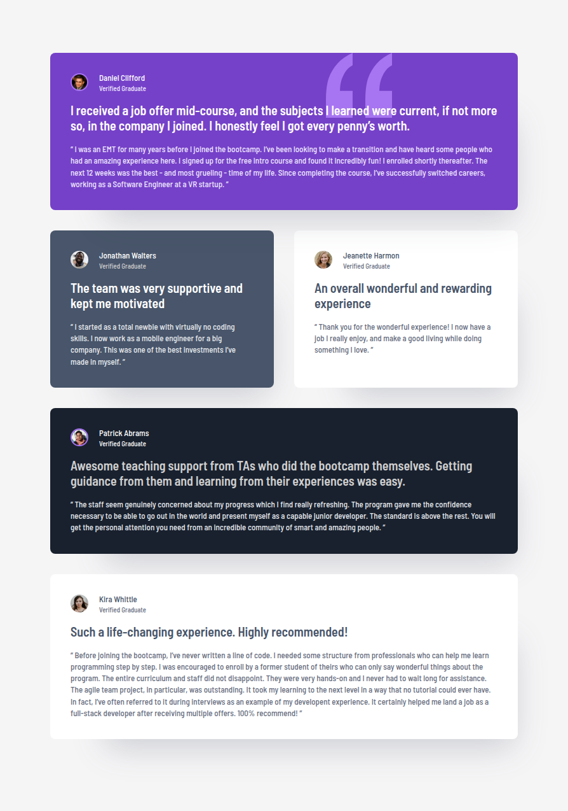

# Frontend Mentor - Testimonials grid section solution

This is a solution to the [Testimonials grid section on Frontend Mentor](https://www.frontendmentor.io/challenges/testimonials-grid-section-Nnw6J7Un7).
Frontend Mentor challenges help improve frontend skills by building realistic UI components.

## Table of contents

- [Overview](#overview)
  - [Preview](#screenshot)
  - [Links](#links)
- [Features](#features)
- [My process](#my-process)
  - [Built with](#built-with)
  - [What I learned](#what-i-learned)
- [Setup](#setup)
  - [Installation](#installation)
  - [Development](#development)
  - [Build](#build)
  - [Linting](#linting)
- [Deployment](#deployment)
- [Performance](#performance)
- [Continued Development](#continued-development)
- [Useful Resources](#useful-resources)
- [AI Collaboration](#ai-collaboration)
- [Author](#author)
- [Notes](#notes)

## Overview

### The challenge

Users should be able to:

- View the optimal layout for the site depending on their device's screen size

### Preview

<details>
  <summary>Click to expand website preview</summary>
  <br>
  <p align="center">
    
  </p>
</details>

### Links

- Solution URL: [GitHub Repo](https://github.com/vlrnsnk/testimonials-grid-section)
- Live Site URL: [Live Site](https://vlrnsnk.github.io/testimonials-grid-section)

## Features

- Fully responsive testimonial grid layout
- Mobile-first workflow with adaptive grid transitions
- Semantic and accessibility-focused HTML structure
- Reusable BEM component architecture
- SCSS modular architecture using `@use`
- CSS custom properties for scalable design tokens
- Fluid responsive spacing and layout constraints
- Decorative assets implemented with pseudo-elements
- Stylelint configuration with property ordering
- Optimized Vite production build
- Automated GitHub Pages deployment with GitHub Actions

## My process

### Built with

- Semantic HTML5 markup
- SCSS (abstracts, base, layout, components)
- BEM naming methodology
- CSS custom properties
- Flexbox
- CSS Grid
- Mobile-first responsive workflow
- Vite
- Stylelint
- HTML validation
- Husky pre-commit hooks

### What I learned

- How to create responsive grid layouts that balance pixel-accurate designs with fluid behavior between breakpoints
- How to improve component styling by using CSS custom properties as state tokens instead of duplicating modifier styles

## Setup

### Installation

```bash
npm install
```

### Development

```bash
npm run dev
```

### Build

```bash
npm run build
npm run preview
```

### Linting

```bash
npm run lint:scss
npm run lint:html
```

This project uses Stylelint + EditorConfig + Husky pre-commit hooks
to ensure consistent code formatting before commits.

### Fix linting issues:

```bash
npm run lint:scss:fix
npm run lint:html:fix
```

## Deployment

Project is built with Vite and deployed to GitHub Pages using GitHub Actions.

## Performance

Lighthouse score (example):

- Performance: 100
- Accessibility: 100
- Best Practices: 100
- SEO: 100

## Continued Development

I want to continue improving my responsive layout systems, especially creating fluid layouts that behave naturally between breakpoints instead of only matching fixed design widths.

I also want to further refine:

- CSS Grid layout strategies for asymmetric layouts
- scalable design token systems
- accessibility best practices
- responsive typography and spacing systems
- production-level component architecture

## Useful Resources

- [MDN Web Docs - CSS Grid Layout](https://developer.mozilla.org/en-US/docs/Web/CSS/CSS_grid_layout) - Helped me better understand advanced grid positioning and spanning strategies for the testimonial layout.

- [Every Layout](https://every-layout.dev/) - Great resource for learning modern responsive layout principles and constraint-based design approaches.

- [BEM Methodology](https://getbem.com/) - Useful reference for organizing reusable and scalable component class structures.

## AI Collaboration

I used ChatGPT, Claude, and Gemini during this project.

The AI tools were most helpful for:

- reviewing semantic HTML structure
- discussing responsive layout strategies
- improving BEM naming consistency
- debugging CSS Grid behavior
- refining SCSS architecture and token organization
- exploring UX/UI best practices for responsive card sizing

What worked well:

- architecture discussions
- accessibility feedback
- responsive layout problem-solving
- alternative implementation ideas

What did not work as well:

- some AI suggestions conflicted with semantic or accessibility best practices
- responsive layout recommendations sometimes prioritized exact design matching over fluid UX behavior, so manual judgment and testing were still necessary

## Author

- Website: https://vlrnsnk.com
- Frontend Mentor: https://www.frontendmentor.io/profile/vlrnsnk
- GitHub: https://github.com/vlrnsnk

## Notes

- Accessibility-focused semantic markup
- Mobile-first responsive workflow
- Reusable BEM component structure
- Modular SCSS architecture using `@use`
- CSS custom properties for scalable theming
- Consistent styling enforced with Stylelint
- Optimized Vite build pipeline
- GitHub Pages deployment with GitHub Actions
